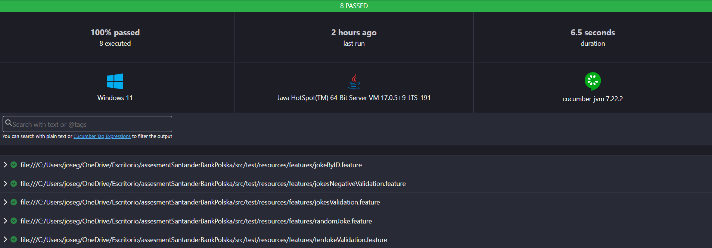

# Joke API Test Automation Framework

This project is an automated test framework for the **Official Joke API**. It is developed in **Java 17** using **Maven**, **Cucumber**, and **RestAssured**, and it allows testing main endpoints as well as negative scenarios of the API.

---

## 1️⃣ Prerequisites

Before running the tests, you need to install and configure the following:

### 1. Java 17

- **Why Java 17?**  
  Java 17 is a stable LTS version, fully compatible with RestAssured 5.5.5 and Cucumber 7.22.2, and widely supported in modern CI/CD pipelines.

- **Download and install:**  
  [Adoptium (OpenJDK 17)](https://adoptium.net/temurin/releases/?version=17)  
  Follow the instructions for your operating system.

  - **Verify installation:**

        java -version

    It should return something like 17.x.x

### 2. Maven

- **Why Maven?**  
  Maven is used to manage dependencies, plugins, build the project, and run tests.

- **Download and install:**

  [Maven](https://maven.apache.org/download.cgi)
  - **Verify installation:**
  
        mvn -version

    It should show Maven 3.x.x and Java 17 as the JDK.

### 3. IDE (optional but recommended)

- **[IntelIJ](https://www.jetbrains.com/idea/download/?section=windows)**
- **IDE setup:**
  
    Open the project as a Maven project

    Configure Project SDK to Java 17

    Ensure Project language level is 17

##  2️⃣ Clone the project and initial setup

1. **Clone the repository:**

        git clone https://github.com/JoseManuelGraoSoto/assesmentSantanderBankPolska.git

2. **Open the project in IntelliJ:**

    File → Open → select project folder

    IntelliJ will detect it as a Maven project automatically.

3. **Configure the JDK in IntelliJ:**

    File → Project Structure → Project → Project SDK → select Java 17

    Ensure Project language level is also set to 17.

4. **Refresh Maven:**

    IntelliJ → Maven → Reload Project

    This downloads all dependencies defined in pom.xml.

##  3️⃣ About the pom.xml

- **The pom.xml file is used to:**

    Declare dependencies such as Cucumber, RestAssured, and JUnit

    Configure the build and plugins (for example, Maven Surefire to run tests)

    Manage versions and library compatibility

- **Main Dependencies**

| Library        | Version  | Main Use                                           |
|----------------|---------|--------------------------------------------------|
| Cucumber Java  | 7.22.2  | Writing features and step definitions           |
| Cucumber JUnit | 7.22.2  | Running Cucumber tests with JUnit 4             |
| JUnit          | 4.13.2  | Testing framework for assertions and runners    |
| RestAssured    | 5.5.5   | Making HTTP requests and validating responses  |
| Json-Path      | 5.5.5   | Parsing JSON and validating response content   |

All versions were obtained from [mvnrepo](mvnrepository.com) and were chosen to ensure compatibility and stability with Java 17.

## 4️⃣ Project Structure

- `/src/main/java`  
   API client (e.g., `JokeApiClient`, `ApiConfig`)

- `/src/test/java`  
  Step Definitions, Test Runners

- `/src/test/resources/features`  
  Cucumber `.feature` files

- `pom.xml`  
  Project configuration and dependencies

- `README.md`  
  Documentation

- `DEVLOG.md`  
  Development log

> ⚠️ All RestAssured and Cucumber code is in `/src/test/java` because these are tests, not production code.

## 5️⃣ How to Execute Tests

### Option 1 - Using Maven from Terminal

    mvn clean test 

Runs all tests in src/test/java

Displays results in the console, including the status of each scenario (passed/failed)

### Option 2 – Using the Cucumber Runner in IntelliJ

Open the class runners.RunnerTest

Right-click → Run 'RunnerTest'

IntelliJ will execute the tests and show results in the Run window

A visual report will be generated in target/cucumber-report.html which can be opened in any browser

## 🤖 AI Usage Disclosure

This project uses AI tools only in a **supporting role**, and all core test logic was implemented manually.

- **README.md and DEVLOG.md:**  
  AI was used to help write and structure the documentation in a clear and professional way. I provided prompts and reviewed all content carefully before including it.

- **Cucumber Feature – DataTable validation:**  
  While writing the feature to validate response fields:
  I had difficulty figuring out how to validate different types in the table. AI suggested using "ANY" for the type field in the feature and then performing the actual type checks in the step definitions, which I implemented manually.
- **Report Generated with Cucumber:**
I have been generating reports with Allure in my work, but to make it faster and easier AI suggested to add "html:target/cucumber-report.html" to the Runner class options. 

